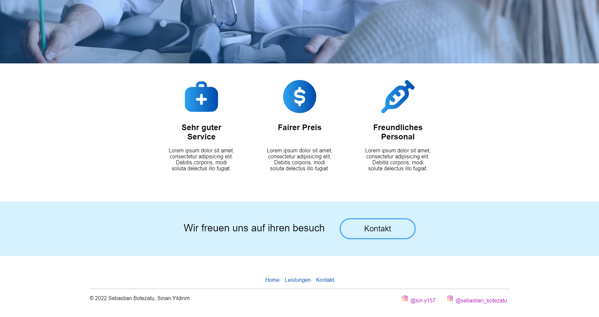

# Pflichtenheft der Praxis Niederrhein, Inc.

Die "Praxis Niederrhein AG", ein pharmazeutisches Unternehmen aus Krefeld, hat uns gebeten, eine neue Website für sie zu erstellen. 

Das Zielpublikum sind Patienten aller Altersgruppen, und sie haben uns auch eine Liste von [technischen](#technischen-anforderungen), als auch [inhaltlichen](#inhaltliche-anforderungen) Anforderungen gegeben, die die Website erfüllen soll. 

Die Frist für dieses Projekt läuft bis spätestens Donnerstag, den 20. Oktober.

# Technischen Anforderungen

In technischer Hinsicht benötigt das Unternehmen Folgendes:
- die Website sollte eine schnelle Ladezeit haben
- eine Verfügbarkeit von mehr als 99,5%
- keine Fehler
- die Website sollte statisch sein
- die Website sollte über eine Domain erreichbar sein
- eine benutzerfreundliche Oberfläche
- die Website sollte nur mit HTML, CSS und Javascript erstellt werden
- kein CMS

# Inhaltliche Anforderungen

Zu den inhaltlichen Anforderungen gibt es ein paar Anleitungen und Ideen, wie sich die Praxis Niederrhein ihre Website vorstellt. Die Website sollte Folgendes enthalten:

- Videos und Bilder von der Praxis
- ein neues Logo
- wie günstig ihre Preise sind
- wie freundlich die Mitarbeiter sind
- eine "Kontakt"-Seite mit einem Formular und einer Adresse 
- eine "Leistungen"-Seite, auf der man sehen kann, was das Unternehmen seinen Kunden bieten kann
- eine "Home"-Seite, die den Besucher willkommen heißt 
- eine Farbpalette, die auch die Farben '#2ea3f0' ("Picton Blue") und '#004aad' ("Cobalt) enthält
- eine Kopfzeile und eine Fußzeile

# Das Konzept
## Woche 1:

In der ersten Woche begannen wir damit, unsere Materialien (Bilder, Videos) zu ordnen und unsere ersten Konzepte für die Website zu entwerfen. Nach vielen Versuchen und einem Meinungsaustausch zwischen unserem Team haben wir beschlossen, dass die Website ähnlich wie diese aussehen soll:

Unser nächster Meilenstein war der Entwurf für das Logo. Wir sind der Meinung, dass es die Freundlichkeit und Professionalität der Praxis Niederrhein gut repräsentiert und haben uns deshalb für dieses Logo entschieden.

## Woche 2:

Unserem Team gelang es, ein Konzept für die Website sowie ein neues Logo für das Unternehmen zu entwerfen. Unser nächstes Ziel war es, die ersten Prototypen zu entwickeln.
### 1) Die HOME-Seite

Wie wir sehen können, sieht die Website schon jetzt gut aus. Während der Entwicklung dieses Prototyps hat unser Team jedoch beschlossen, einige Änderungen vorzunehmen, wie z. B. den "Erfahren Sie über uns"-Button unter dem Willkommenstext in der Mitte. Dieser Button sollte eine Animation haben, wenn der Besucher mit dem Mauszeiger darüber fährt, und er sollte ihn auch zur Seite "Leistungen" weiterleiten, wenn er darauf klickt.

Wir haben in dieser Woche viele verschiedene Konzepte ausprobiert, z. B. das Hinzufügen eines Farbverlaufs von oben nach unten, das Experimentieren mit den Farben und das Ändern des Hintergrundbildes für die Website.

Schließlich haben wir uns entschieden, für die HOME-Seite ein Video anstelle eines Bildes zu verwenden, das mit reduzierter Geschwindigkeit abgespielt und wiederholt werden soll. Für die anderen Seiten haben wir beschlossen, ein statisches Hintergrundbild zu verwenden.

- LEISTUNGEN

Wir haben uns auch für einen sehr subtilen Farbverlauf (für alle Seiten) sowie eine leicht transparente Navigationsleiste entschieden, damit ihr Inhalt (das Logo und die Buttons) von anderen Elementen auf der Seite unterschieden werden kann.

### 2) Die LEISTUNGEN-Seite

Hier haben wir uns für etwas sehr Einfaches entschieden: einen großen, weißen Text, der den Besucher der Website ansprechen soll. 

Unterhalb dieses Textes wollten wir eine Box hinzufügen, in der alle Leistungen des Unternehmens präsentiert werden.

### 3) Die KONTAKT-Seite

Auch für die KONTAKT-Seite haben wir uns entschieden, das Element der Einfachheit der vorherigen Seiten beizubehalten. Daher haben wir uns für ein einfaches (und dennoch modern aussehendes) Kontakt-Formular entschieden.
Immer, wenn sich der Besucher in einem Textfeld befindet, sollten dessen Ränder in "Picton-Blue" leuchten (eine der vom Kunden gewünschten Farben). Wenn sich der Mauszeiger über der Schaltfläche "Senden" befindet, ändert sich die Farbe ebenfalls in "Cobalt" (eine weitere vom Kunden vorgegebene Farbe).

Unsere letzte Änderung an der Website war das Hinzufügen einer speziellen Fußzeile für die HOME-Seite, die Elemente wie die sozialen Netzwerke des Unternehmens, Beschreibungen ihrer Leistungen und Preise sowie eine weitere Möglichkeit zur Navigation zwischen den Seiten enthält.
- Fußzeile für die HOME-Seite

- Fußzeile für LEISTUNGEN und KONTAKT

## Woche 3

In Woche 3 hatte unser Team die Website vollständig fertiggestellt. Wir haben es auch geschafft, die vorgegebene Frist einzuhalten, genau wie der Kunde es wollte. 

Alle erforderlichen Dateien wurden auf die Git-Domain hochgeladen, unter https://sebot002.pages.ide3.de/praktikum-1-web/.
von dem aus der Kunde auf seine Website zugreifen kann.

